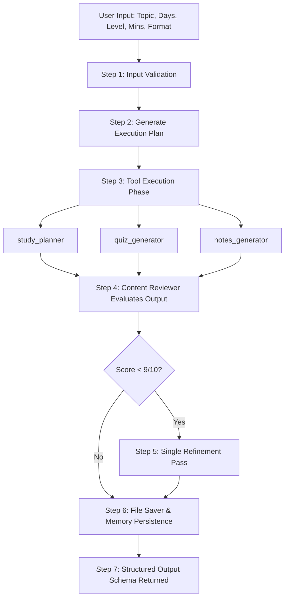

# 🎓 AI Study Buddy Agent

> **Fully Local Agentic AI Curriculum & Practice Generator**  
> Powered by local LLMs via **Ollama (`llama3.2:latest`)**, built with Python, Streamlit, and a robust 7-step autonomous agentic workflow.

---

## 📌 Project Overview

The **AI Study Buddy Agent** is an intelligent, privacy-first study assistant designed to create tailored study plans, practice quizzes, and revision notes for any subject or skill level. It runs entirely on local infrastructure with zero reliance on cloud LLM APIs.

### Key Capabilities
- 📅 **Custom Multi-Day Schedules**: Calculates daily study minutes and breaks learning goals into realistic, timed activities.
- ❓ **Interactive Practice Quizzes**: Generates multiple-choice and short-answer questions verified against daily plan topics.
- 📝 **Concise Revision Notes**: Synthesizes daily bullet-point takeaways and executive summaries.
- ⭐ **Autonomous Quality Review**: Evaluates plan difficulty, time limits, and pedagogical depth using a built-in evaluator tool.
- 🔄 **Self-Correction Improvement Pass**: Automatically refines weak plan spots when reviewer score is < 9/10.
- 💾 **Persistent Memory & Storage**: Saves Markdown documents and JSON session metrics to structured output directories.
- 🖥️ **Dual Interface**: Offers both a modern **Streamlit Web UI** and an interactive **ASCII CLI**.

---

## 🏗️ System Architecture & 7-Step Workflow



### The 7-Step Agent Lifecycle
1. **Input Validation**: Sanitizes learning topic, duration (1-30 days), level (`beginner`, `intermediate`, `advanced`), daily limit (15-480 mins), and format choice (`full`, `plan_and_quiz`, `plan_and_notes`, `plan_only`).
2. **Execution Planning**: Generates an explicit numbered task breakdown before launching tool routines.
3. **Sequential Tool Execution**: Invokes custom LLM tools equipped with automatic execution logging (`@log_tool_call`).
4. **Content Review**: Runs `content_reviewer` to assess time constraint compliance, topic clarity, and score out of 10.
5. **Self-Improvement Step**: Applies reviewer recommendations in a single prompt refinement pass if quality score < 9.
6. **File & Memory Persistence**: Formats markdown files (`outputs/generated_posts/`, `outputs/generated_scripts/`) and records session stats in `outputs/saved_results/memory.json`.
7. **Final Output Schema**: Assembles and returns complete structured dictionary payload with tools called history.

---

## 🛠️ Tool Catalog (7 Core Tools)

| Tool Name | Module Path | Functionality & Target Output |
|---|---|---|
| `study_planner` | [`app/tools.py`](file:///d:/projects/AI%20Study%20Buddy%20Agent/agentic_ai_task_2/app/tools.py#L57-L107) | Generates structured multi-day daily schedules with activity time caps. |
| `quiz_generator` | [`app/tools.py`](file:///d:/projects/AI%20Study%20Buddy%20Agent/agentic_ai_task_2/app/tools.py#L109-L151) | Creates verifiable MCQ and short-answer practice questions. |
| `notes_generator` | [`app/tools.py`](file:///d:/projects/AI%20Study%20Buddy%20Agent/agentic_ai_task_2/app/tools.py#L153-L190) | Produces daily summaries and key takeaway bullet points. |
| `content_reviewer` | [`app/tools.py`](file:///d:/projects/AI%20Study%20Buddy%20Agent/agentic_ai_task_2/app/tools.py#L192-L235) | Evaluates generated output quality (1-10 rating, feedback & suggestions). |
| `file_saver` | [`app/tools.py`](file:///d:/projects/AI%20Study%20Buddy%20Agent/agentic_ai_task_2/app/tools.py#L247-L278) | Persists `.md` and `.json` outputs to dedicated target subfolders. |
| `progress_saver` | [`app/tools.py`](file:///d:/projects/AI%20Study%20Buddy%20Agent/agentic_ai_task_2/app/tools.py#L237-L244) | Updates completed day metrics and quiz scores in memory. |
| `memory_tool` | [`app/tools.py`](file:///d:/projects/AI%20Study%20Buddy%20Agent/agentic_ai_task_2/app/tools.py#L280-L311) | Manages historical learning sessions and user stats in `memory.json`. |

---

## 📁 Directory Layout

```text
agentic_ai_task_2/
├── app/
│   ├── __init__.py
│   ├── agent.py         # 7-step core agent loop & validation logic
│   ├── config.py        # Ollama health checks, model paths & prompt query wrapper
│   ├── main.py         # Streamlit Web Application UI
│   ├── memory.py        # Memory persistence layer (memory.json management)
│   ├── prompts.py       # JSON-constrained system prompts & templates
│   └── tools.py         # 7 core tools with @log_tool_call tracking
├── outputs/
│   ├── generated_posts/ # Markdown study plan files (*_study_plan.md)
│   ├── generated_scripts/ # Markdown quiz/notes files (*_quiz_notes.md)
│   └── saved_results/   # Full JSON outputs & memory.json persistence
├── report/
│   └── REPORT.md        # Comprehensive technical report & architecture documentation
├── tests/
│   ├── run_tests.py     # Automated 10-topic benchmark suite
│   ├── test_cases.md    # Generated benchmark results table
│   ├── test_stage2.py   # Stage 2 individual tool & memory integration test
│   ├── test_stage3.py   # Stage 3 agent workflow & schema test
│   ├── test_stage4.py   # Stage 4 CLI interface automated test
│   └── test_stage5.py   # Stage 5 Streamlit UI syntax & import test
├── demo.py              # Interactive Terminal CLI Application
└── requirements.txt     # Python dependency specifications
```

---

## ⚡ Quick Start Guide

### 1. Prerequisites & Ollama Setup
Ensure [Ollama](https://ollama.ai/) is installed and running locally. Pull the default `llama3.2:latest` model:

```bash
# Start Ollama service (if not already running)
ollama serve

# Pull local LLM model
ollama pull llama3.2:latest
```

### 2. Install Python Dependencies
```bash
pip install -r requirements.txt
```

---

## 🚀 Running the Application

### Option A: Streamlit Web UI (Recommended)
Launch the interactive web application:
```bash
streamlit run app/main.py
```
Open your browser at `http://localhost:8501` to access:
- Parameter sidebar configuration (Topic, Duration, Level, Time limit, Format).
- Live execution status log expander with executed tools badges.
- Tabbed view for Study Plan, Practice Quiz, Revision Notes, and Quality Score.
- Results export button for saving & downloading JSON payloads.

### Option B: Terminal CLI Interface
Launch the interactive terminal interface:
```bash
python demo.py
```

---

## 🧪 Running Automated Tests

Run the full suite of automated verification scripts:

```bash
# Stage 1 & Ollama Health Verification
python app/config.py

# Stage 2: Individual Tools & Memory Layer Integration Test
python tests/test_stage2.py

# Stage 3: 7-Step Agent Workflow & Output Schema Test
python tests/test_stage3.py

# Stage 4: Interactive CLI Subprocess Test
python tests/test_stage4.py

# Stage 5: Streamlit Application Imports & Syntax Test
python tests/test_stage5.py

# Full 10-Topic Automated Benchmark Suite (Generates tests/test_cases.md)
python tests/run_tests.py
```

---

## 📊 Verification & Compliance
- **100% Local Inference**: Zero third-party cloud LLM API dependencies.
- **Strict JSON Output Constraint**: Prompt engineering enforces clean JSON parsing without markdown wrappers.
- **Robust Fallbacks**: Built-in fallback handlers ensure valid data structures even during model generation edge cases.
- **Time Constraint Normalization**: Automatically rescales daily activity durations if the model exceeds `daily_minutes`.
